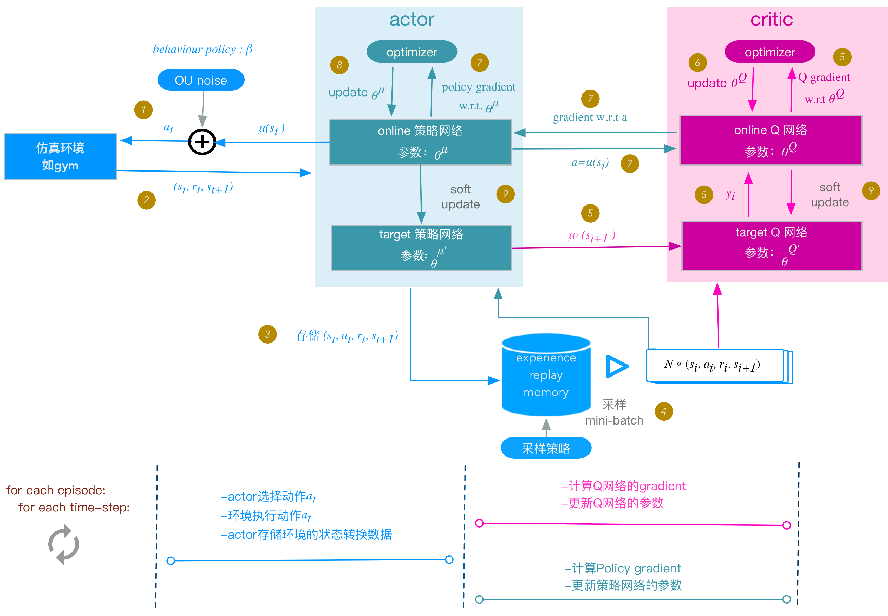

# simpleDRL
深度强化学习若干算法的简单实现
神经网络框架：PyTorch 1.8

#### 参考：
知乎高赞回答[如何入门强化学习](https://www.zhihu.com/question/277325426/answer/816094591), 编写1.1，2.1部分。

知乎优秀文章[如何选择深度强化学习算法](https://zhuanlan.zhihu.com/p/342919579), 提供相关学习路线。

## 1. 离散动作空间

### 1.1 DQN

DQN解决 [CartPole-v0](https://gym.openai.com/envs/CartPole-v1/)

### 1.2 DDQN

DDQN解决 [LunarLander-v2](https://gym.openai.com/envs/LunarLander-v2/)

## 2. 连续动作空间

### 2.1 DDPG

DDPG解决 [Pendulum-v0](https://gym.openai.com/envs/Pendulum-v0/)

	
### 2.2 PPO

PPO2解决 [LunarLanderContinuous-v2](http://gym.openai.com/envs/LunarLanderContinuous-v2/)

参考：

[Coding PPO from Scratch with PyTorch](https://medium.com/analytics-vidhya/coding-ppo-from-scratch-with-pytorch-part-1-4-613dfc1b14c8)

[EasyRL-PPO](https://github.com/datawhalechina/easy-rl/tree/master/codes/PPO)
